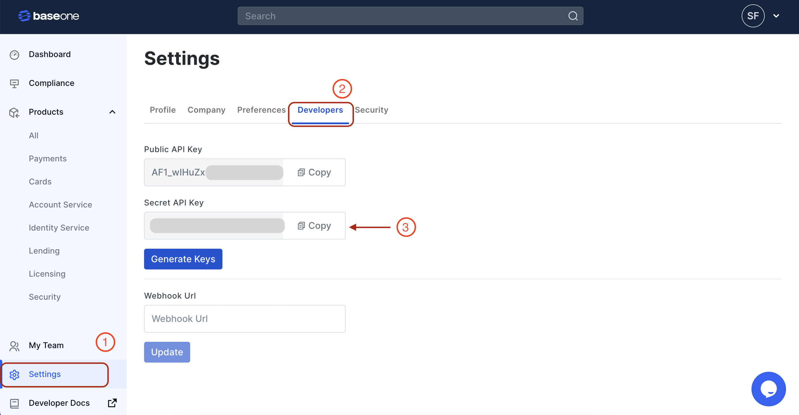

# API Authentication

Secure your BaseOne API requests with proper authentication and authorization.

## Overview

BaseOne API uses API keys for request authentication. Manage your keys in the **Developers** section of the **Settings** menu in the BaseOne dashboard.

> ⚠️ **API Keys Support Update**
>
> After January 2023, only secret keys will be supported for API calls. Existing customers can use public keys until then.
>
> **Note:** You may need to generate new key pairs if your previous keys aren't working.

## Key Features

- 🔑 **Universal Access**: Each API Key works with all BaseOne services (payouts, virtual accounts, etc.)
- 🔀 **Environment-Specific**: Sandbox keys for testing, live keys for production
- 🔒 **Secure**: Keep your API keys confidential and never share them publicly

## Getting Your API Keys

1. Navigate to the **Settings** menu in the left-side navigation bar
2. Click on the **Developers** tab
3. Copy the secret API key for authentication
4. Use the **Generate Keys** button to create new key pairs if needed

_A walkthrough of creating an API key for a BaseOne service_

## Using Your API Keys

1. Copy the secret key from your API key pair
2. Include it as `api-key` in the request headers when making API calls
3. Example (Postman):

_Adding the api-key in Postman's Headers tab_

## Important Security Notes

- 🔒 Always use HTTPS for API calls; HTTP requests will be rejected
- 🚫 Unauthenticated API requests will not be fulfilled
- 🔐 Never share your API keys on public platforms (e.g., GitHub, client-side code)
